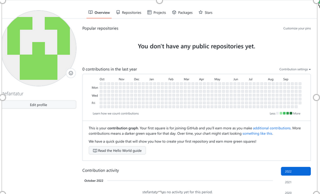

---
## Front matter
title: "Отчет лабораторной работы №3"
subtitle: "НММ-бд-03-22"
author: "Татур Стефан Андреевич"

## Generic otions
lang: ru-RU
toc-title: "Содержание"

## Bibliography
bibliography: bib/cite.bib
csl: pandoc/csl/gost-r-7-0-5-2008-numeric.csl

## Pdf output format
toc: true # Table of contents
toc-depth: 2
lof: true # List of figures
lot: true # List of tables
fontsize: 12pt
linestretch: 1.5
papersize: a4
documentclass: scrreprt
## I18n polyglossia
polyglossia-lang:
  name: russian
  options:
	- spelling=modern
	- babelshorthands=true
polyglossia-otherlangs:
  name: english
## I18n babel
babel-lang: russian
babel-otherlangs: english
## Fonts
mainfont: PT Serif
romanfont: PT Serif
sansfont: PT Sans
monofont: PT Mono
mainfontoptions: Ligatures=TeX
romanfontoptions: Ligatures=TeX
sansfontoptions: Ligatures=TeX,Scale=MatchLowercase
monofontoptions: Scale=MatchLowercase,Scale=0.9
## Biblatex
biblatex: true
biblio-style: "gost-numeric"
biblatexoptions:
  - parentracker=true
  - backend=biber
  - hyperref=auto
  - language=auto
  - autolang=other*
  - citestyle=gost-numeric
## Pandoc-crossref LaTeX customization
figureTitle: "Рис."
tableTitle: "Таблица"
listingTitle: "Листинг"
lofTitle: "Список иллюстраций"
lotTitle: "Список таблиц"
lolTitle: "Листинги"
## Misc options
indent: true
header-includes:
  - \usepackage{indentfirst}
  - \usepackage{float} # keep figures where there are in the text
  - \floatplacement{figure}{H} # keep figures where there are in the text
---

# Цель работы

Целью данной работы является изучение идеологии и применение средств контроля версий. Работа и ознакомление с системой GIT. 

# Выполнение лабораторной работы

1. Прежде чем приступить к работе, создаю аккаунт на Github. 

2. Далее настроил Git,используя терминал. 

3. Создаю SSH ключ и вношу его в github. 

 
4. Далее создаю репозиторий.
 
5. Клонирую созданный репозиторий и настраиваю каталог курса. 

Выполнение самостоятельной работы 
 
1. Добавляю отчет в каталог, воспользовавшись общей папкой и при помощи команды git commit. 

2. Скопировал прошлые работы в соответствующие каталоги. Использовал команду git push  
 

3. Перенесем файлы на github.

 

# Выводы

Познакомился с github. Создал структуру курса и скомпилировал ее на github.

:::
