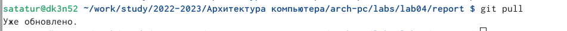
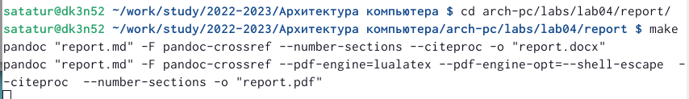
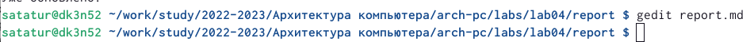

---
## Front matter
title: "Шаблон отчёта по лабораторной работе №4"
subtitle: "НММ-бд-03-22"
author: "Стефан Андреевич Татур"

## Generic otions
lang: ru-RU
toc-title: "Содержание"

## Bibliography
bibliography: bib/cite.bib
csl: pandoc/csl/gost-r-7-0-5-2008-numeric.csl

## Pdf output format
toc: true # Table of contents
toc-depth: 2
lof: true # List of figures
lot: true # List of tables
fontsize: 12pt
linestretch: 1.5
papersize: a4
documentclass: scrreprt
## I18n polyglossia
polyglossia-lang:
  name: russian
  options:
	- spelling=modern
	- babelshorthands=true
polyglossia-otherlangs:
  name: english
## I18n babel
babel-lang: russian
babel-otherlangs: english
## Fonts
mainfont: PT Serif
romanfont: PT Serif
sansfont: PT Sans
monofont: PT Mono
mainfontoptions: Ligatures=TeX
romanfontoptions: Ligatures=TeX
sansfontoptions: Ligatures=TeX,Scale=MatchLowercase
monofontoptions: Scale=MatchLowercase,Scale=0.9
## Biblatex
biblatex: true
biblio-style: "gost-numeric"
biblatexoptions:
  - parentracker=true
  - backend=biber
  - hyperref=auto
  - language=auto
  - autolang=other*
  - citestyle=gost-numeric
## Pandoc-crossref LaTeX customization
figureTitle: "Рис."
tableTitle: "Таблица"
listingTitle: "Листинг"
lofTitle: "Список иллюстраций"
lotTitle: "Список таблиц"
lolTitle: "Листинги"
## Misc options
indent: true
header-includes:
  - \usepackage{indentfirst}
  - \usepackage{float} # keep figures where there are in the text
  - \floatplacement{figure}{H} # keep figures where there are in the text
---

# Цель работы

Целью работы является упрощение дальнейшей работы путем создания нужного отчета сразу в трех форматах: docx,md и pdf.И оформление отчетов с помощью легковесного языка Markdown.

# Выполнение лабораторной работы
1)Открываю терминал и перехожу в каталог курса,созданный в лабораторной работе номер 3. Обновим локальный репозиторий,скачав изменения из удаленного репозитория с помощью команды git pull.
{ #fig:001 width=70% }
2) Далее я перешел в каталог с шаблоном отчета по лаб №4 и провел компиляцию шаблона с использованием makefile.С помощью ls проверил корректность выполнения команды.
{ #fig:001 width=70% }
3)Удалил полученный файл с использованием makefile и откроем файл report.md c помощью текстового редактора gedit.
{ #fig:001 width=70% }
4)Заполнил отчети скомпилировал с использованием makefile.
5)Загрузим файлы на github.
6)Сделаем отчет по лабораторной работе в формате markdown.В качествеотчета предоставил отчеты в 3 форматах: pdf,docx и md.Загрузил файлы на github.

# Выводы

Я ознакомился с лекговесным языком разметки Markdown.Установил необходимое программное обеспечение.Сделал прошлы отчеты в трех форматах: docx,md,pdf.

::: {#refs}
:::
