---
## Front matter
title: "Лабораторная работа №5"

author: "Татур Стефан"

## Generic otions
lang: ru-RU
toc-title: ""

## Bibliography
bibliography: bib/cite.bib
csl: pandoc/csl/gost-r-7-0-5-2008-numeric.csl

## Pdf output format
toc: true # Table of contents
toc-depth: 2
lof: true # List of figures
lot: true # List of tables
fontsize: 12pt
linestretch: 1.5
papersize: a4
documentclass: scrreprt
## I18n polyglossia
polyglossia-lang:
  name: russian
  options:
	- spelling=modern
	- babelshorthands=true
polyglossia-otherlangs:
  name: english
## I18n babel
babel-lang: russian
babel-otherlangs: english
## Fonts
mainfont: PT Serif
romanfont: PT Serif
sansfont: PT Sans
monofont: PT Mono
mainfontoptions: Ligatures=TeX
romanfontoptions: Ligatures=TeX
sansfontoptions: Ligatures=TeX,Scale=MatchLowercase
monofontoptions: Scale=MatchLowercase,Scale=0.9
## Biblatex
biblatex: true
biblio-style: "gost-numeric"
biblatexoptions:
  - parentracker=true
  - backend=biber
  - hyperref=auto
  - language=auto
  - autolang=other*
  - citestyle=gost-numeric
## Pandoc-crossref LaTeX customization
figureTitle: "Рис."
tableTitle: "Таблица"
listingTitle: "Листинг"
lofTitle: "Список иллюстраций"
lotTitle: "Список таблиц"
lolTitle: "Листинги"
## Misc options
indent: true
header-includes:
  - \usepackage{indentfirst}
  - \usepackage{float} # keep figures where there are in the text
  - \floatplacement{figure}{H} # keep figures where there are in the text
---

# Цель работы

Ознакомиться с низкоуровневым языком программирования Assembler. Освоение процедуры компиляции и сборки программ.

# Выполнение лабораторной работы

1. Создал каталог для работы с программами на языке ассемблера NASM. И перешел в созданный каталог. (рис. [-@fig:001])

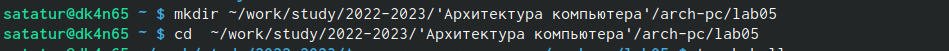

2. Создал текстовый файл с именем hello.asm

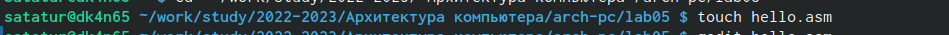

3. Открыл этот файл с помощью gedit.Далее ввел в него нужный текст.

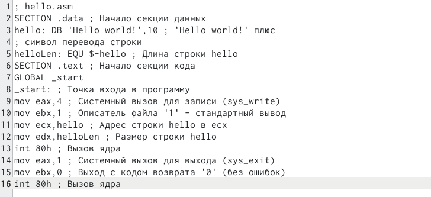

4. Для компиляции приведённого выше текста программы «Hello World» воспользовался командой представленной ниже.

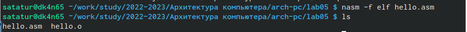

5. Скомпилировал исходный файл hello.asm в obj.o с помощью следующей команды.

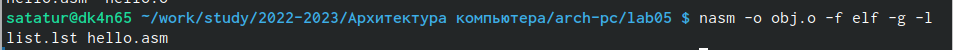

6. Далее передал объектный файл на обработку компоновщику.

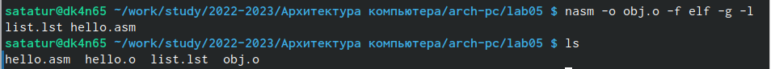

7. Выполнил следующую команду и создал "main".

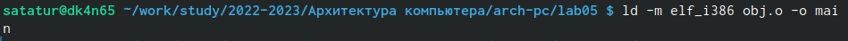

8. Запустил на выполнение созданный исполняемый файл, находящийся в текущем каталоге,набрав в командной строке команду "./hello".

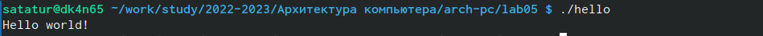

# Выполнение самостоятельной работы

1. В каталоге ~/work/arch-pc/lab05 с помощью команды cp создал копию файла hello.asm с именем lab5.asm

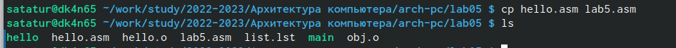

2. Внес изменения в текст программы в файле lab5.asm так, чтобы вместо Hello world! на экран выводиться строка с моей фамилией и именем.

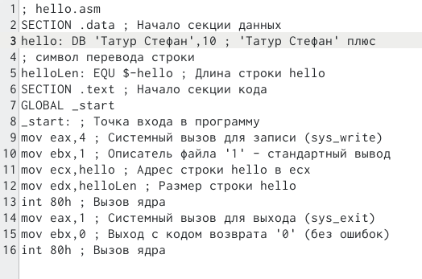

3. Оттранслировал полученный текст программы lab5.asm в объектный файл. Выполнил компоновку объектного файла и запустил получившийся исполняемый файл.

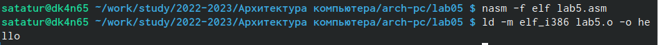

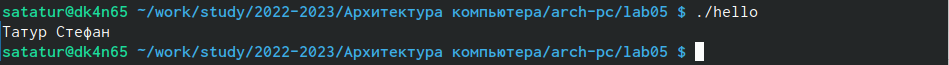 

4. Скопировал файлы hello.asm и lab5.asm в свой локальный репозеторий в каталог ~/work/study/2022-2023/"Архитектура компьютера"/arch-pc/labs/lab05/. 

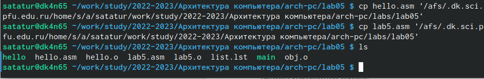

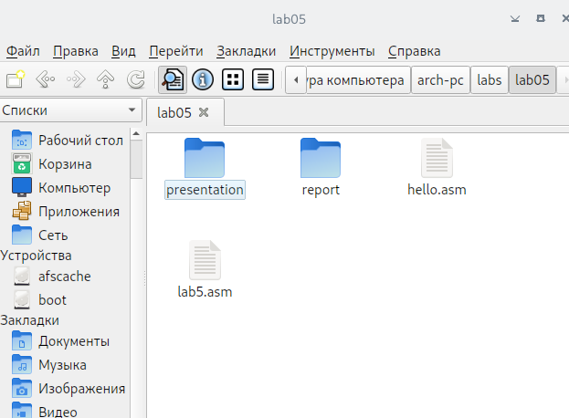

5. Загрузил файлы на Github.

# Выводы

Ознакомился с низкоуровневым языком программирования Assembler. Освоил процедуры компиляции и сборки программ. Разместил файлы на github.

::: {#refs}
:::
