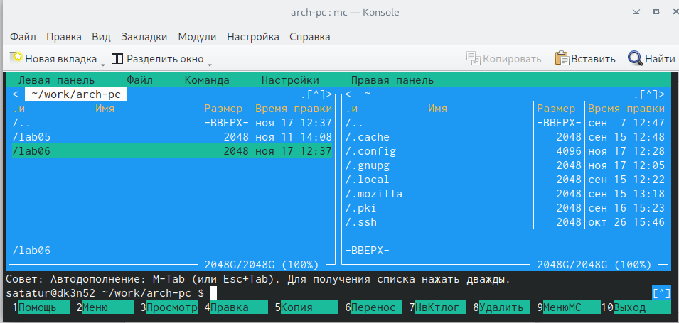
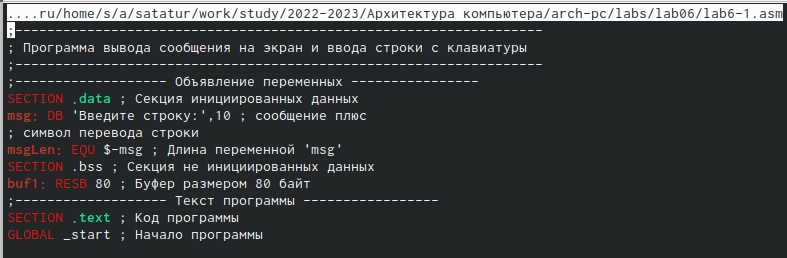
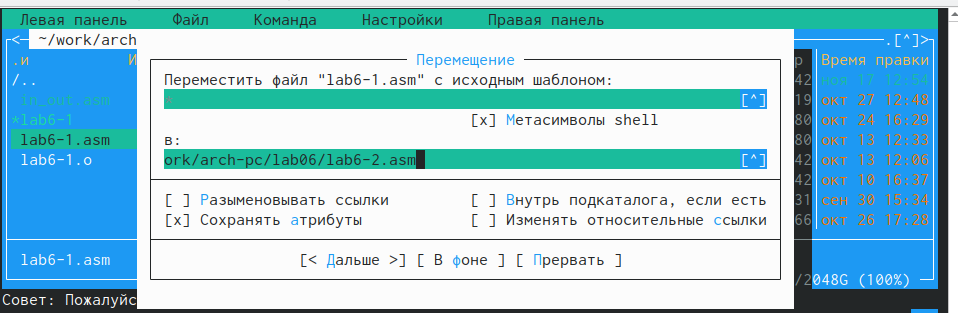

---
## Front matter
title: "Лабораторная работа №6"
subtitle: "Простейший вариант"
author: "Татур Стефан"

## Generic otions
lang: ru-RU
toc-title: "Содержание"

## Bibliography
bibliography: bib/cite.bib
csl: pandoc/csl/gost-r-7-0-5-2008-numeric.csl

## Pdf output format
toc: true # Table of contents
toc-depth: 2
lof: true # List of figures
lot: true # List of tables
fontsize: 12pt
linestretch: 1.5
papersize: a4
documentclass: scrreprt
## I18n polyglossia
polyglossia-lang:
  name: russian
  options:
	- spelling=modern
	- babelshorthands=true
polyglossia-otherlangs:
  name: english
## I18n babel
babel-lang: russian
babel-otherlangs: english
## Fonts
mainfont: PT Serif
romanfont: PT Serif
sansfont: PT Sans
monofont: PT Mono
mainfontoptions: Ligatures=TeX
romanfontoptions: Ligatures=TeX
sansfontoptions: Ligatures=TeX,Scale=MatchLowercase
monofontoptions: Scale=MatchLowercase,Scale=0.9
## Biblatex
biblatex: true
biblio-style: "gost-numeric"
biblatexoptions:
  - parentracker=true
  - backend=biber
  - hyperref=auto
  - language=auto
  - autolang=other*
  - citestyle=gost-numeric
## Pandoc-crossref LaTeX customization
figureTitle: "Рис."
tableTitle: "Таблица"
listingTitle: "Листинг"
lofTitle: "Список иллюстраций"
lotTitle: "Список таблиц"
lolTitle: "Листинги"
## Misc options
indent: true
header-includes:
  - \usepackage{indentfirst}
  - \usepackage{float} # keep figures where there are in the text
  - \floatplacement{figure}{H} # keep figures where there are in the text
---

# Цель работы

Преобрести практические навыки работы с программой ассемблер,Midnight Commander.

# Выполнение лабораторной работы

1. Откроем **Midnight Commander**.И с помощью функциональной клавиши F7 создаем папку lab06.Далее я перешел в созданный каталог.

2. Пользуясь строкой ввода и командой touch создал файл lab6-1.asm

3. С помощью функциональной клавиши F4 открыл файл lab6-1.asm для редактирования во встроенном редакторе. Я использую редактор **mcedit**.Далее я ввел текст программы из листинга 6.1,сохранил изменения и закрыл файл.

4. С помощью функциональной клавиши F3 открыл файл lab6-1.asm для просмотра. Убедился, что файл содержит текст программы.

5. Далее я оттранслировал текст программы lab6-1.asm в объектный файл. Выполнил компоновку объектного файла и запустил получившийся исполняемый файл. Программа выводит строку 'Введите строку:' и ожидает ввода с клавиатуры. На запрос я ввел свою фамилию и имя.

6. Я скачал файл in_out.asm со страницы курса в ТУИС и переместил его в файл с программой.

7. С помощью функциональной клавиши F6 создал копию файла lab6-1.asm с именем lab6-2.asm. 

8. Исправил текст программы в файле lab6-2.asm с использование подпрограмм из внешнего файла in_out.asm.Я использовал подпрограммы sprintLF, sread и quit в соответствии с листингом 6.2. Далее создал исполняемый файл и проверил его работу.

9. В файле lab6-2.asm заменил подпрограмму sprintLF на sprint. Создал исполняемый файл и проверил его работу. Разница в том,что текст выводится на той же строке,где расположена фраза "Введите строку",а не на отдельной.

# Выполнение самостоятельной работы

1. Создал копию файла lab6-1.asm и назвал ее lab6-3.asm. Внес изменения в программу (без
использования внешнего файла in_out.asm), так чтобы она работала по алгоритму указанному в задании.

2. 

3. 

4. Создал копию файла lab6-2.asm и назвал ее lab6-4.asm. Исправил текст программы с использованием подпрограмм из внешнего файла in_out.asm.

5. Проверил работу программы.

# Выводы

Получил практические навыки работы с редакторами nano и gedit. А также познакомился с Midnight Commander. 

# Список литературы{.unnumbered}

::: {#refs}
:::
