---
## Front matter
title: "Лабораторная работа 7"
subtitle: "Архитектура ЭВМ"
author: "Татур Стефан Андреевич"

## Generic otions
lang: ru-RU
toc-title: "Содержание"

## Bibliography
bibliography: bib/cite.bib
csl: pandoc/csl/gost-r-7-0-5-2008-numeric.csl

## Pdf output format
toc: true # Table of contents
toc-depth: 2
lof: true # List of figures
lot: true # List of tables
fontsize: 12pt
linestretch: 1.5
papersize: a4
documentclass: scrreprt
## I18n polyglossia
polyglossia-lang:
  name: russian
  options:
	- spelling=modern
	- babelshorthands=true
polyglossia-otherlangs:
  name: english
## I18n babel
babel-lang: russian
babel-otherlangs: english
## Fonts
mainfont: PT Serif
romanfont: PT Serif
sansfont: PT Sans
monofont: PT Mono
mainfontoptions: Ligatures=TeX
romanfontoptions: Ligatures=TeX
sansfontoptions: Ligatures=TeX,Scale=MatchLowercase
monofontoptions: Scale=MatchLowercase,Scale=0.9
## Biblatex
biblatex: true
biblio-style: "gost-numeric"
biblatexoptions:
  - parentracker=true
  - backend=biber
  - hyperref=auto
  - language=auto
  - autolang=other*
  - citestyle=gost-numeric
## Pandoc-crossref LaTeX customization
figureTitle: "Рис."
tableTitle: "Таблица"
listingTitle: "Листинг"
lofTitle: "Список иллюстраций"
lotTitle: "Список таблиц"
lolTitle: "Листинги"
## Misc options
indent: true
header-includes:
  - \usepackage{indentfirst}
  - \usepackage{float} # keep figures where there are in the text
  - \floatplacement{figure}{H} # keep figures where there are in the text
---

# Цель работы
Освоить арифметические инструкции языка ассемблера NASM.

# Выполнение лабораторной работы

1. Создаем каталог для программ лабораторной работы №7, переходим в него и создаем файл lab7-1.asm.

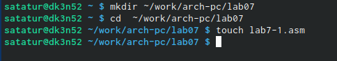

2. Вводим в файл lab7-1.asm текст программы из листинга 7.1.

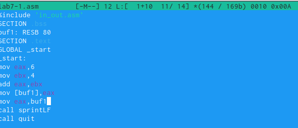

3. Создаем испольняемый файл и запускаем его.

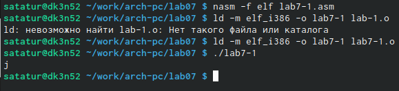

4. Изменяем текст программы и вместо символов, запишем в регистры числа. Создаем исполняемый файл и запускаем его. В данном случае выводится символ с кодом 10 - перенос строки.

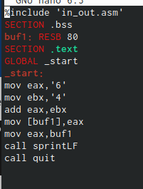

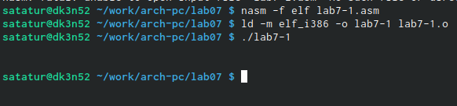

5. Создаем файл lab7-2.asm, вводим в него текст программы из листинга 7.2.

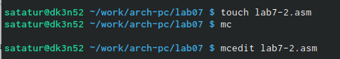

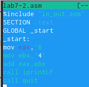

6. Создаем испольняемый файл и запускаем его.

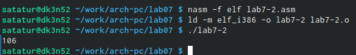

7. Изменяем текст программы аналогично с lab7-1.asm. Создаем исполяемый файл и запускаем его.

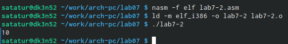

8. Также заменяем функцию iptrintLF на iprint. Создаем исполяемый файл и запускаем его.

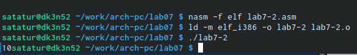

9. Создаем файл lab7-3.asm, вводим в него текст программы из листинга 7.3.

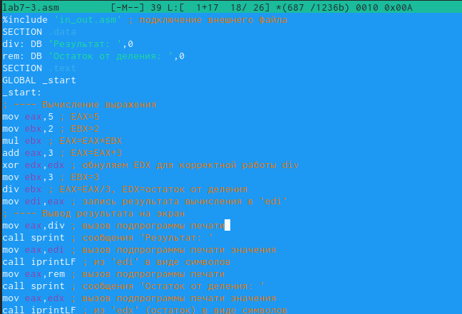

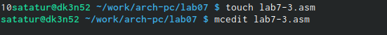

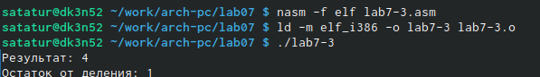 

10. Создаем испольняемый файл и запускаем его.

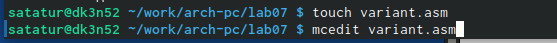

11. Изменяем текст программы для вычисления выражения f(x)=(8𝑥 − 6)/2. Создаем испольняемый файл и запускаем его.

12. Создаем файл variant.asm, вводим в него текст программы из листинга 7.4.

13. Создаем испольняемый файл и запускаем его.

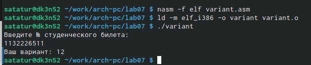

# Самостоятельная работа

1. Создаем файл expression.asm, вводим в него текст программы для вычисления выражения f(x)=(8𝑥 − 6)/2.

2. Создаем испольняемый файл и запускаем его. Для проверки возьмем 2 значения: x1=1 | x2=5.

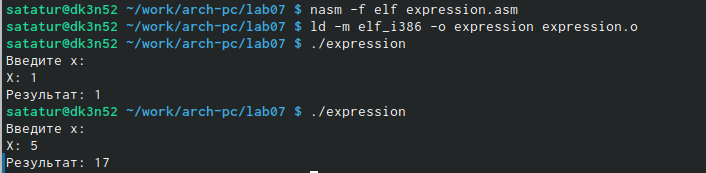

